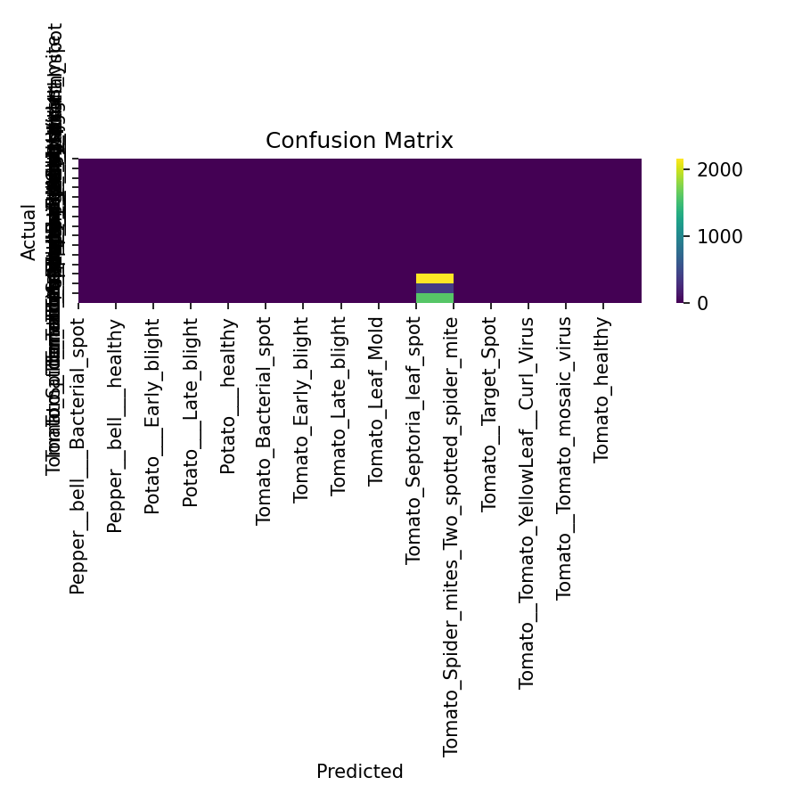

PlantDocX — Plant Disease Classification (with Grad-CAM)

A compact, production-ready workflow to train and run a plant disease image classifier on the PlantVillage dataset and to generate explanations (Grad-CAM / Score-CAM overlays). It’s optimized for Windows paths and a notebook workflow.

Segmentation (leaf masks) is an optional Stage-1 add-on. The current README focuses on the classifier you’ve trained and used.

What you get

Artifacts saved into C:\Users\sagni\Downloads\PlantDocX\:

cls_model.keras and cls_model.h5 — the Keras classifier (SavedModel & H5).

preprocessor.pkl — image size, normalization flag, class_names.

model_config.yaml — backbone, image size, augmentations, thresholds.

metrics.json — global metrics (accuracy, macro-F1, etc. if computed).

Plots:

loss_curve.png (if you trained and saved it)

confusion_matrix.png (validation CM)

roc_curve.png, pr_curve.png (optional)

Per-image predictions (when you run inference):

<image>_prediction.png (final label)

<image>_top5.png (top-5 probabilities)

<image>_cam.png (Grad-CAM or Score-CAM overlay)

<image>_prediction.json (all details)

Your dataset directory:

C:\Users\sagni\Downloads\PlantDocX\archive\PlantVillage

The folder must contain one subfolder per class, e.g.
Tomato___Early_blight, Potato___healthy, Pepper__bell___Bacterial_spot, etc.

Environment

Python 3.10+ (3.11 works)

TensorFlow 2.14+ / Keras 3.x

scikit-learn, matplotlib, pillow, pyyaml

Example install (CPU):

pip install "tensorflow>=2.14,<2.17" keras==3.* scikit-learn matplotlib pillow pyyaml

Quick start
1) Train (or reuse your existing model)

If you already have cls_model.keras & preprocessor.pkl in C:\Users\sagni\Downloads\PlantDocX, you can skip to Inference.

Typical training notebook cell (you already ran a variant of this):

Builds training/validation datasets from PlantVillage

Trains an EfficientNet/ResNet for 1–5 epochs (adjustable)

Saves .keras, .h5, .pkl, .yaml, plots & confusion matrix

Tip: if you saw a warning like “_PrefetchDataset has no attribute class_names”, capture class_names before calling .prefetch() (or from the image_dataset_from_directory return prior to any .map/.cache/.prefetch).

2) Evaluate

When the eval cell runs, it produces:

confusion_matrix.png — your validation confusion matrix

(optional) ROC/PR curves if you selected those

Open them from C:\Users\sagni\Downloads\PlantDocX\.

3) Inference on a single image + explanation

Use the robust prediction cell (you already ran a version of this) that:

loads cls_model.keras + preprocessor.pkl,

predicts on an image (e.g., download.jpg),

generates Grad-CAM, and if gradients aren’t available, falls back to Score-CAM,

saves overlay and JSON.

Outputs (example):

C:\Users\sagni\Downloads\PlantDocX\download_prediction.png
C:\Users\sagni\Downloads\PlantDocX\download_top5.png
C:\Users\sagni\Downloads\PlantDocX\download_cam.png
C:\Users\sagni\Downloads\PlantDocX\download_prediction.json

The JSON includes the chosen class, probability, top-5, the CAM method used, and artifact paths.

Dataset split & class names

We build training/validation from the directory tree with:

PlantVillage/
  class_A/
    img1.jpg
    ...
  class_B/
    imgX.jpg

class_names are taken directly from subfolder names, sorted by the loader.

They’re stored inside preprocessor.pkl so inference doesn’t need to re-scan the dataset.

Confusion matrix

Once you’ve run evaluation, see:

C:\Users\sagni\Downloads\PlantDocX\confusion_matrix.png

This image shows the validation confusion matrix with labeled axes for your 15 PlantVillage classes. Use it to spot which disease pairs are commonly confused (e.g., Tomato Septoria vs Tomato mosaic virus).

File structure
C:\Users\sagni\Downloads\PlantDocX\
  cls_model.keras
  cls_model.h5
  preprocessor.pkl
  model_config.yaml
  metrics.json
  loss_curve.png
  confusion_matrix.png
  roc_curve.png            (optional)
  pr_curve.png             (optional)
  <image>_prediction.png   (per-image when you run inference)
  <image>_top5.png
  <image>_cam.png
  <image>_prediction.json

Configuration

Example model_config.yaml content (automatically written by the training cell):

project: PlantDocX
backbone: EfficientNetB0
image_size: [224, 224]
rescale_in_model: true
augmentations:
  random_flip: horizontal
  random_rotation: 0.05
  random_zoom: 0.1
training:
  epochs: 1
  batch_size: 32
  optimizer: adam
  learning_rate: 0.0005
  loss: categorical_crossentropy
  metrics: [accuracy]
classes: 15

Tips & common issues

classification_report ValueError (Different number of classes vs target_names)
Happens when not all classes appear in the validation set or when the label list doesn’t match class_names.
Fix: build labels from the present classes in y_true or compute report with labels=sorted(np.unique(y_true)) and map those indices to names.

Grad-CAM returns None gradients
Some modern backbones (wrapping or fused layers) can break the gradient path.
Our inference cell falls back to Score-CAM (forward-only) automatically.

Different number of model outputs vs stored class_names
The inference cell warns and constructs fallback names (class_0, class_1, …). Re-train to keep them aligned.

Windows paths with spaces
Always use raw strings (prefix with r"...") in Python for paths like
r"C:\Users\sagni\Downloads\PlantDocX\archive\PlantVillage".

Reproducibility

A fixed random seed is set in the training cell.

The exact backbone/aug/training settings are preserved in model_config.yaml.

Class names and image size live in preprocessor.pkl.

Next steps

Add Stage-1 Segmentation: train a light U-Net on pseudo-masks (GrabCut) to create leaf masks; feed the masked images into the classifier to reduce background bias.

Balanced sampling: if classes are imbalanced, use class weights or re-sampling for better macro-F1.

Export to mobile: try TFLite conversion with dynamic range quantization for edge devices.

Grad-CAM++ / Score-CAM variants: add alternative explainers for robustness.

Minimal usage snippets

Load & predict on one image:

import os, pickle, numpy as np, tensorflow as tf
from PIL import Image, ImageOps

OUT = r"C:\Users\sagni\Downloads\PlantDocX"
MODEL = os.path.join(OUT, "cls_model.keras")
PP    = os.path.join(OUT, "preprocessor.pkl")

with open(PP, "rb") as f:
    pp = pickle.load(f)
size = tuple(pp.get("image_size", (224,224)))
rescale_in_model = bool(pp.get("rescale_in_model", True))
class_names = pp["class_names"]

model = tf.keras.models.load_model(MODEL, safe_mode=False)

img_path = r"C:\Users\sagni\Downloads\PlantDocX\download.jpg"
pil = Image.open(img_path).convert("RGB")
pil = ImageOps.exif_transpose(pil)
m = min(pil.size); x0=(pil.width-m)//2; y0=(pil.height-m)//2
pil = pil.crop((x0,y0,x0+m,y0+m)).resize(size)
x = tf.keras.utils.img_to_array(pil)[None].astype("float32")
if not rescale_in_model: x /= 255.0

probs = model.predict(x, verbose=0)[0]
idx = int(np.argmax(probs))
print(class_names[idx], float(probs[idx]))
Result:

Open confusion matrix:

from PIL import Image
Image.open(r"C:\Users\sagni\Downloads\PlantDocX\confusion_matrix.png").show()

Acknowledgments
Author:

SAGNIK PATRA
PlantVillage dataset (Kaggle mirror).

TensorFlow/Keras team for excellent tooling.
